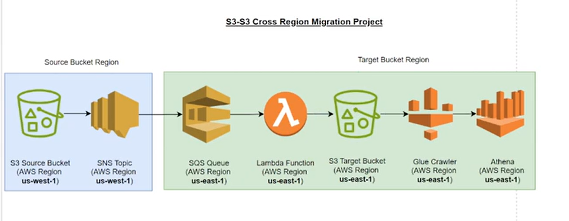

## S3-to-S3-CrossRegionMigration

### Project Overview

 

In this project, we are using AWS S3, SNS, SQS, and Lambda to transfer a data file from an S3 bucket in the source region to an S3 bucket in the target region (your default region).

Once the data is loaded into the target region's S3 bucket, we will use SQS to send a notification to trigger Glue crawler to generate a table in the Glue catalog.

After the table is created in the Glue catalog, we will leverage AWS Athena to query the data and analyze its contents.

##### After completing this project in AWS, someone will learn how to:

Migrate data between S3 buckets in different regions using services like SNS, SQS, and Lambda.

Automate workflows with AWS Lambda, responding to events and triggering actions like data transfer.

Catalog data in AWS Glue by using Glue crawlers to create tables in the Glue Data Catalog.

Query data stored in S3 using AWS Athena with the Glue catalog for schema management.

Understand and work with cross-region data management and serverless architectures in AWS.

Overall, they will gain experience in building serverless, automated, and scalable data processing workflows in the cloud.

## Project Steps

#### Create S3 Buckets
Set up two S3 buckets: one in the source region to hold the data file and one in the target region (your default region) for storing the transferred data.

#### Set Up SNS (Simple Notification Service)
Create an SNS topic that will be used to notify when a new file is uploaded to the source S3 bucket, which will trigger downstream actions.

#### Create SQS Queue
Set up an SQS queue that will receive notifications from SNS and trigger the Lambda function for processing the data file.

#### Develop Lambda Function
Create a Lambda function that listens to the SQS queue, moves the data file from the source S3 bucket to the target S3 bucket, and sends a notification to trigger the Glue crawler after the transfer.

#### Set Up Glue Crawler
Configure and run the Glue crawler to scan the target S3 bucket, detect the schema, and create a table in the Glue Data Catalog.

#### Configure S3 Event Notification
Configure an S3 event in the source bucket to publish notifications to the SQS topic whenever a new file is uploaded..

#### Set Up Athena for Querying
Configure Athena to use the Glue Data Catalog and run SQL queries to analyze the data stored in the target S3 bucket.

#### Test the Workflow
Upload a test file to the source S3 bucket, check if the data is transferred correctly, and ensure that the Glue crawler runs and Athena can query the data.